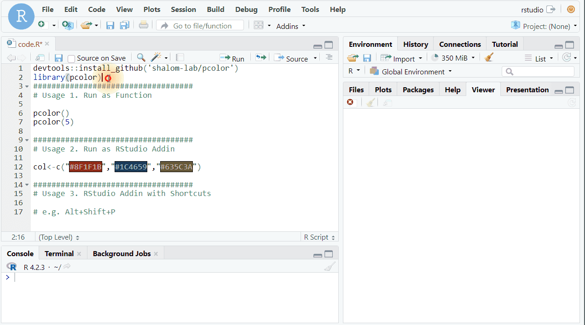

# pcolor

The goal of pcolor is to help your pick color freely in RStudio

## Installation

You can install the development version of pcolor from
[GitHub](https://github.com/) with:

``` r
# install.packages("devtools")
devtools::install_github("shalom-lab/pcolor")
```

## Example

This is a basic example which shows you how to solve a common problem:

``` r
devtools::install_github('shalom-lab/pcolor')
library(pcolor)
###################################
# Usage 1. Run as Function

pcolor()
pcolor(5)

###################################
# Usage 2. Run as RStudio Addin

col<-c("#BF6861","#1C4659","#635C3A")

###################################
# Usage 3. RStudio Addin with Shortcuts 

# e.g. Alt+Shift+P 
```

## Demo


